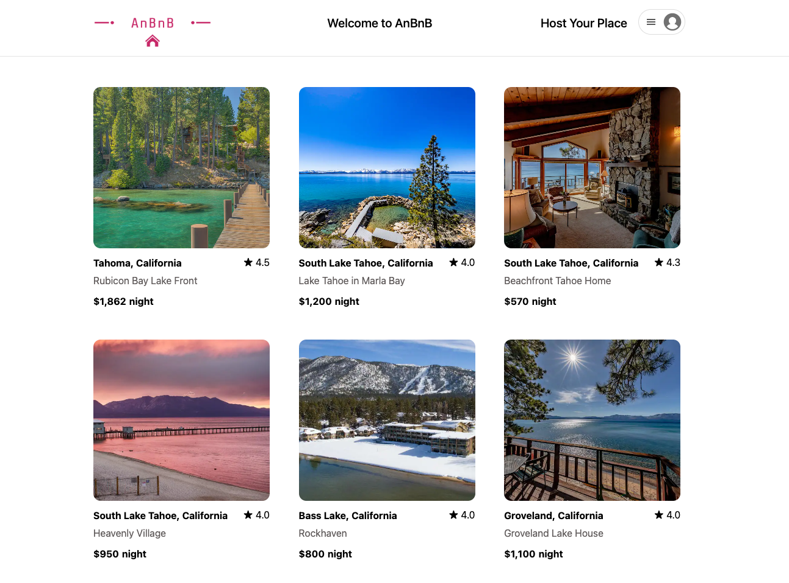
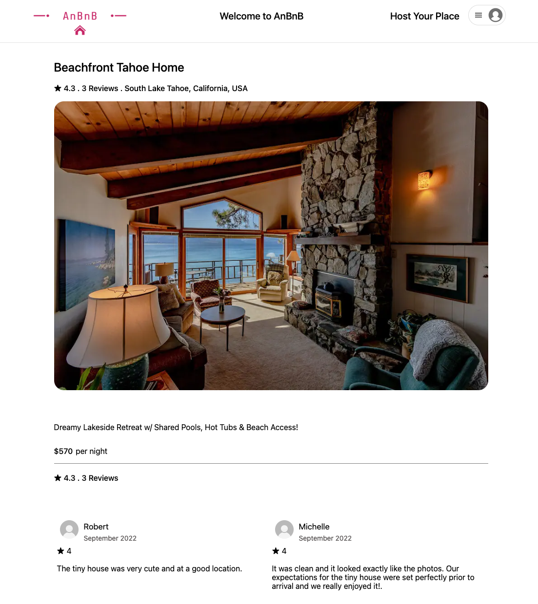
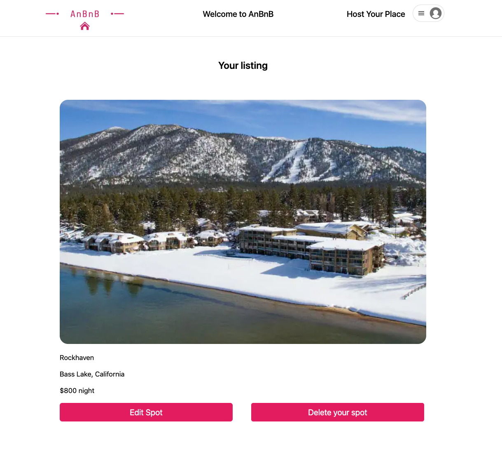
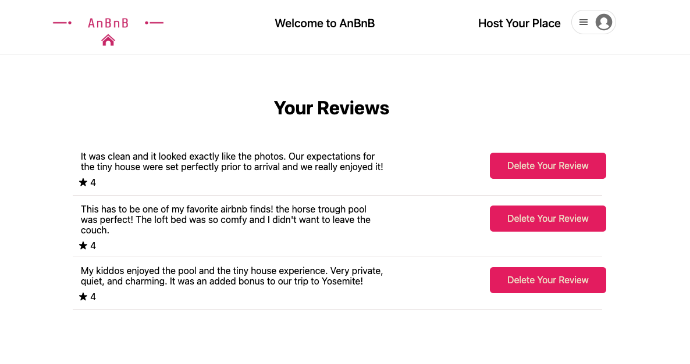

# AnBnB (AirBnB Clone)

AnBnB is a full-stack-application clone of Airbnb deployed on heroku. The App uses React & Redux in the Front-end and for the backend we use Express.js & an ORM called Sequelize.

Live Link: https://anbnb.herokuapp.com/

## This application was built with:

- Javascript
- React
- Redux
- HTML
- CSS
- Express
- Sequelize
- PostgresSQL

## Features:

### Home Page

You will be able to test the features without sign up by clicking on the "Demo User" button

### Spot Details Page

### User Listings

### User Reviews

### Get started: setting up the repo to run the project locally

If you would like to launch this site locally please follow these instructions:

1. Clone this repo by using your terminal by going to a directory of where you would want the file stored and type in git clone https://github.com/Anbui0115/week12-Airbnb.git
2. Change directories (cd) into the 'backend' directory and run the command in the CLI: npm install what this command does is grab all the dependencies needed for the application.
3. In the same directory(backend) create a .env file and add your own values to these variables: PORT, DB_FILE (location of the database), JWT_SECRET, and JWT_EXPIRES_IN
4. In the same directory(backend) load the migrations database by running the command in the CLI npx dotenv sequelize db:migrate
5. In the same directory(backend) load the seeder data into your database by running the command in the CLI npx dotenv sequelize db:seed:all
6. Now run the command in the CLI npm start to turn your backend server on.
7. Now run the command in another terminal in the CLI npm start If you have Google Chrome this should have started the React Application for you. If this fails you can just go to to the url of localhost:3000
8. Both frontend & backend should be running in order for you to see the application.

   You can also have the same result by just going to the repository link and downloading zip file and extract it to a folder on your device.

### Contact information
